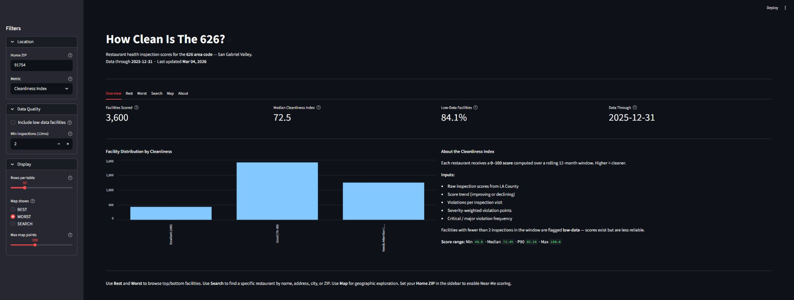
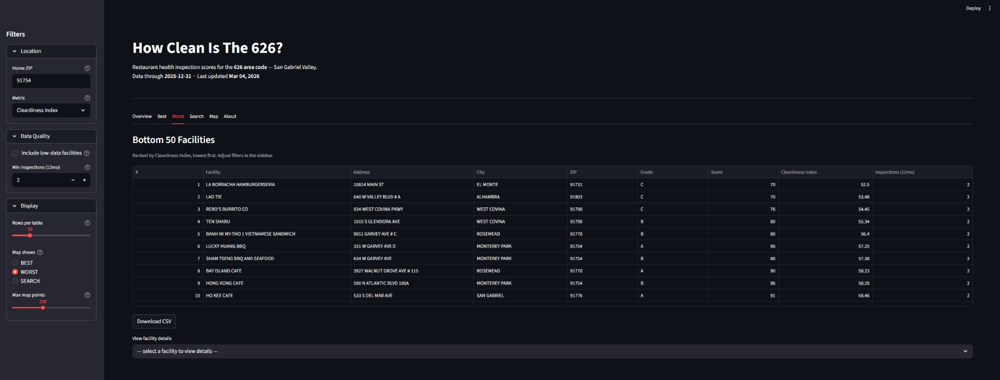
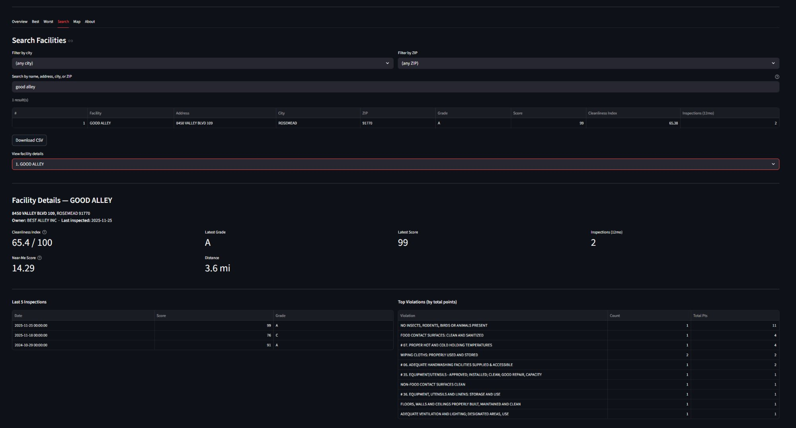
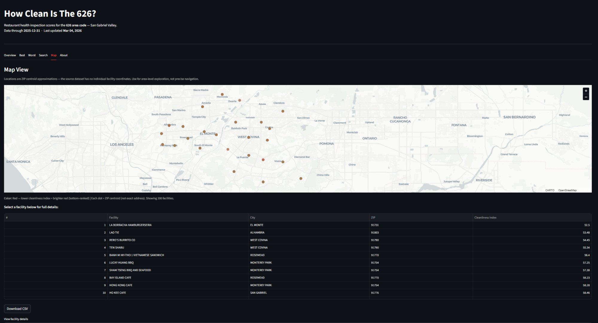
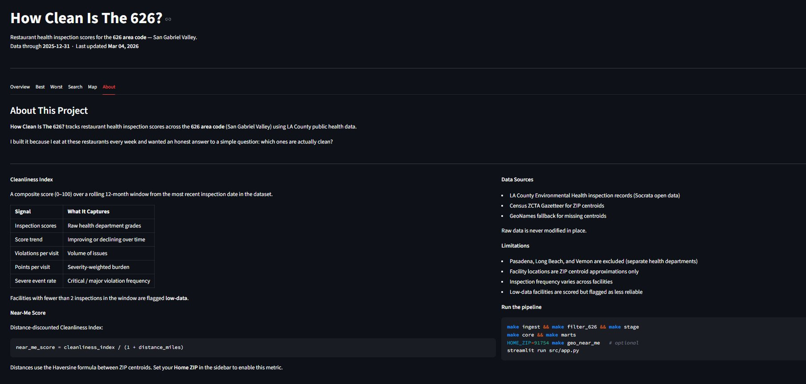

# How Clean Is The 626?

[](https://github.com/Leeaaronn/How-Clean-Is-The-626/actions/workflows/ci.yml)

A production-style analytics engineering project that builds a reproducible data pipeline and cleanliness scoring model for restaurants across the San Gabriel Valley (626 area code) using LA County public health inspection data.

I built this because I eat at these restaurants every week and wanted to know which ones are actually clean — and which are repeat offenders.

---

## What It Answers

- **Which SGV restaurants are the cleanest — and which are the worst?**
- **What are the most common health violations in the 626?**
- **Are there repeat offenders, and do they improve after reinspection?**
- **Which restaurants near me have the best cleanliness-to-distance ratio?**

---

## Screenshots

### Overview — KPIs and score distribution



### Worst — Bottom 50 facilities ranked by Cleanliness Index



### Search — Free-text lookup with facility drill-down



### Map — ZIP-centroid geographic exploration



### About — Methodology, data sources, and limitations



---

## Architecture

```
LA County Open Data (Socrata)
        ↓
    ingest.py → raw CSVs
        ↓
    filter_626.py → 626-area records
        ↓
    stage.py → cleaned, typed parquet
        ↓
    core.py → dim_facility + fct_inspection + fct_violation
        ↓
    marts.py → cleanliness index, ZIP health, repeat offenders
        ↓
    geo_near_me.py → distance ranking via Haversine
        ↓
    app.py → Streamlit dashboard
```

Each layer has a single responsibility. Raw data is never modified in place. Every step outputs parquet artifacts to `data/processed/`.

---

## Data Model

Star-schema design with dimension and fact tables:

| Table | Type | Purpose |
|-------|------|---------|
| `dim_facility` | Dimension | Deduplicated facilities with stable `facility_key` via merge logic |
| `fct_inspection` | Fact | One row per inspection — date, score, grade |
| `fct_violation` | Fact | One row per violation — code, description, points, status |

### Mart Tables

| Table | What It Computes |
|-------|-----------------|
| `mart_facility_health` | Cleanliness Index (0–100) per facility; **12-month scoring window** (facilities with no inspections in the trailing 12 months are excluded) |
| `mart_zip_health` | Aggregate health metrics by ZIP code |
| `mart_repeat_offenders` | Facilities with 2+ low scores in 12 months |
| `mart_near_me` | Distance-weighted cleanliness ranking from a home ZIP |

---

## Cleanliness Index

Each facility receives a deterministic score (0–100) computed over a **12-month rolling window** (`ref_date - 365 days`, where `ref_date = MAX(activity_date)` in the dataset). Facilities with no inspections in this window are excluded. Signal components:

| Signal | What It Captures |
|--------|-----------------|
| Inspection scores | Raw health department grades |
| Score trend | Improving or declining over time |
| Violations per inspection | Volume of issues per visit |
| Points per inspection | Severity-weighted violation burden |
| Severe event frequency | Critical / major violation rate |
| Low data flag | Facilities with <2 inspections in the 12-month window are flagged |

Window reference date is `max(activity_date)` — making results fully reproducible.

---

## Near-Me Ranking

Facility coordinates aren't provided in the dataset. Instead, ZIP centroids are derived from Census ZCTA Gazetteer data with GeoNames fallback.

Distance calculated via Haversine formula. Near-me score:

```
near_me_score = cleanliness_index / (1 + distance_miles)
```

This favors both cleanliness and proximity. Default `HOME_ZIP = 91754` (Monterey Park). Override:

```bash
HOME_ZIP=91776 make geo_near_me
```

---

## Data Contracts & Quality

10 schema contracts enforced via JSON definitions:

| Check | What It Validates |
|-------|------------------|
| Not-null rules | Required fields are never empty |
| Type validation | Column types match contract prefix |
| Duplicate key detection | Primary keys are unique |
| Orphan prevention | Every violation maps to an inspection |
| Index bounds | Cleanliness index within 0–100 |
| Geo bounds | Coordinates within valid ranges |
| Distance validation | Non-negative distances |
| Score consistency | `near_me_score ≤ cleanliness_index` |

```bash
make validate    # run all schema contracts
make test        # run pytest suite
```

CI blocks merges if any check fails.

---

## Dashboard

The Streamlit app reads parquet files directly via DuckDB. All queries use parameterized placeholders — no raw user input in SQL.

| Tab | Description |
|-----|-------------|
| Best (Top 50) | Top 50 facilities ranked by `cleanliness_index` |
| Worst (Bottom 50) | Bottom 50 facilities ranked by `cleanliness_index` |
| Search | Free-text search by name, address, city, or ZIP |
| Map | ZIP-centroid map with BEST / WORST / SEARCH modes |

**Map note:** Facility locations are ZIP centroid approximations — the source dataset contains no individual facility coordinates. Points are derived by joining each facility's ZIP to `dim_zip_geo`. Use the map for area-level exploration, not precise navigation.

**Near-me mode:** When `mart_near_me.parquet` exists, the metric selector includes `near_me_score` with distance displayed. If the file is missing, the dashboard shows a warning and falls back to `cleanliness_index`.

---

## Tech Stack

| Tool | Role |
|------|------|
| Python | Core language |
| DuckDB | Analytical queries |
| Parquet | Intermediate data format |
| Streamlit | Dashboard UI |
| Pytest | Testing + quality gates |
| GitHub Actions | CI pipeline |
| Census ZCTA | ZIP centroid geocoding |

---

## Running Locally

```bash
# Install dependencies
python3 -m pip install -r requirements.txt

# Run full pipeline
make ingest filter_626 stage core marts

# Generate near-me rankings (optional)
HOME_ZIP=91754 make geo_near_me

# Launch dashboard
streamlit run src/app.py
```

## Development

```bash
make validate      # schema contract checks
make test          # pytest suite
make lint          # ruff lint check
make format        # auto-format
```

---

## Design Decisions

- **Star schema over flat tables** — separates slowly-changing dimensions from transactional facts, enabling flexible metric computation
- **Deterministic facility_key** — handles unstable facility IDs in source data via merge logic with audited merge rates
- **Parquet over CSV** — typed, compressed, columnar format preserves schema between pipeline steps
- **Contract-driven validation** — 10 JSON schema contracts enforce data quality at every layer, not just at the end
- **ZIP centroids over geocoding APIs** — deterministic, free, reproducible; no API keys or rate limits
- **Adaptive scoring window** — primary window is 12 months; falls back to 24 months for facilities with fewer than 2 recent inspections, balancing recency with enough data to produce a score
- **Parameterized DuckDB queries** — all user input goes through `?` placeholders; column names and sort direction come from controlled selections

---

## Limitations

- **Pasadena, Long Beach, and Vernon** are excluded — they operate separate health departments
- **ZIP centroid approximation** — facility-level coordinates are not available in the source data
- **Low-inspection facilities** are scored but flagged — results are less reliable with <2 inspections
- **Inspection frequency varies** — some facilities are inspected more often, which affects scoring density

---

## Why This Project

I wanted to know if the restaurants I eat at every week are actually clean. The data is public, the question is personal, and the answer required building a real pipeline, not a notebook.

This project demonstrates data modeling, deterministic pipelines, metric design, geo enrichment, contract-driven validation, and production-minded engineering. It reflects how analytics systems should be built, even when the question is simple.